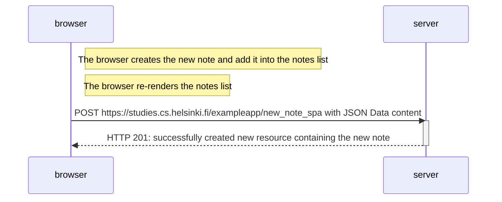

```mermaid
sequenceDiagram
    participant browser
    participant server

    Note right of browser: The browser creates the new note and add it into the notes list
    Note right of browser: The browser re-renders the notes list
    browser->>server: POST https://studies.cs.helsinki.fi/exampleapp/new_note_spa with JSON Data content
    activate server
    server-->>browser: HTTP 201: successfully created new resource containing the new note
    deactivate server
```
